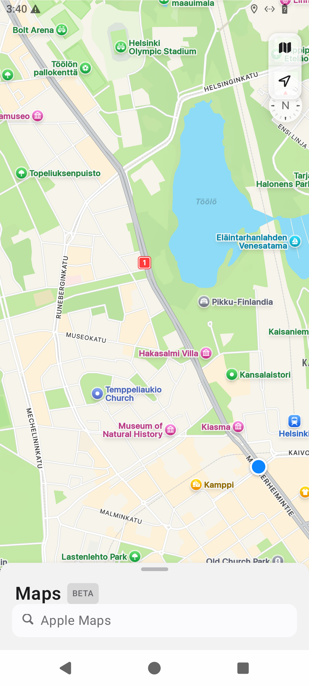
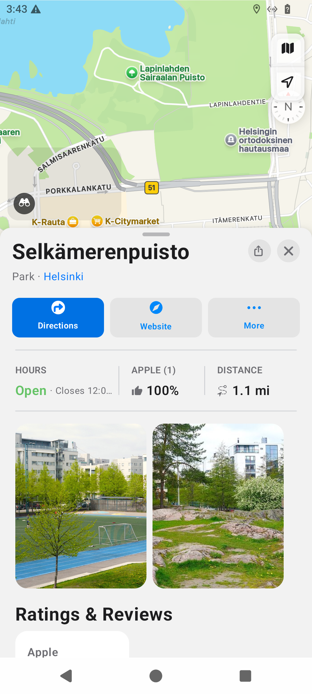
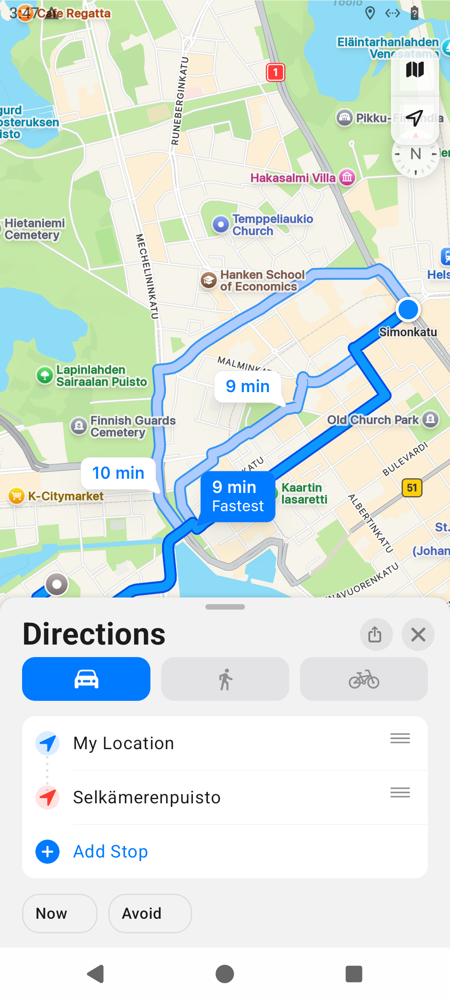
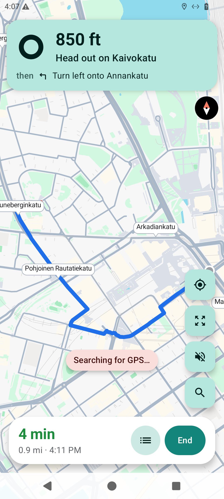

# Apple Maps for Android

Bring a familiar Apple Maps experience to Android—from discovering a new place to arriving at the door.

- **Explore beautifully detailed maps** with Standard, Satellite, and Hybrid views.
- **Discover what is nearby** and search for restaurants, landmarks, shops, parks, and more.
- **Know before you go** with rich place cards, photos, ratings, opening hours, and Look Around.
- **Plan the trip your way** with driving, walking, and cycling routes, alternate choices, departure times, road preferences, and multiple stops.
- **Stay on course** with turn-by-turn guidance, clear maneuver cards, voice directions, route progress, overview, and one-tap recentering.
- **Share the places you love** directly through Android's share menu.

## See it in action

<p align="center">
  
  
  
  
</p>

Search, explore, plan, and navigate in one polished experience designed to make every journey feel effortless.

## Build

```bash
ANDROID_HOME=/opt/android-sdk ./gradlew testDebugUnitTest lintDebug assembleDebug
```

The canonical debug deliverable is copied to the repository root as `applemaps-consumer-nav-debug.apk`.
